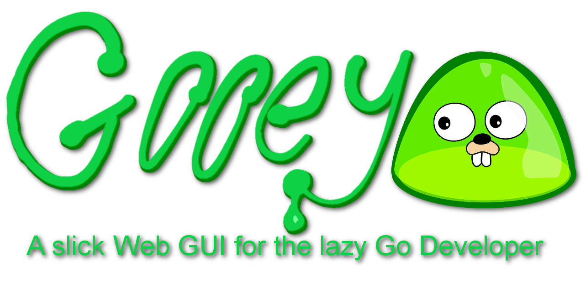

# GOOEY - Slick GUI for the lazy Go Dev

Ever had one of those moments where you are working on a Go service or something and you say "I just want to quickly slap something together that can run some code for me and display it in a way that doesn't look awful?", so you dive into the internet with the belief that "This should be a piece of cake!", but after some searching you quickly discover that either:
- You are going to have to create a whole separate Javascript+HTML rendering thing + your API before you can even get started
- You have completely forgotten how CSS works and cannot be bothered learning other frameworks because "ain't nobody got time for that"
- You hope to have this thing just "plug into your service" is going to take WAY longer than you planned for
- You find a really cool thing, but discover that it does some wierd Chromium thing that is ONLY going to work if you are running the GUI where the process is running
- You just wanted this thing to be quick and the time you spent googling should have been spent slapping this little thing together

Well, you and I think alike, and this is where this project came along. I had a situation where I just wanted a really simple little developer-oriented UI to run a few commands and pull up some data in a nice and friendly way for my Golang services running in AWS. I would only access these services via something like KubeProxy because "hey, I'm a dev and I have access" but the tedium of CLIs and the many things that can go wrong is something you want to avoid. Maybe you want to capture some data that is too difficult to dump to a console log, or there is some internal info that figuring out how to visualize and present it on a graphana daskboard through prometheus is equally a pain. Either way, you need a quick and simple UI you can slap onto a service, or maybe you want to dedicated a pod to run this back-end UI. 

# The Tenets of this project - Praise be to GOOEY
1. Simple and intuitive
2. Suits different levels of lazy
3. As close to pure Go as a UI can get
4. Doesn't look like crap
5. Do (as little to) no evil (as possible)

## Tenet #1: Simple and intuitive
People hate the old Microsoft "WebForms" for all the things it got wrong, but what it got really right was that it dealt with a lot of the messy web and ajax stuff so you didn't have to figure that stuff out. With this we try to get as much of that simplicity in there and let the framework do as much of the thinking as possible.
Out of the box, you can define a "Page" that is going to have the stuff you want on it. You tell the system who will be the parent of your page and it will figure it out for you. You then start slapping some "Components" on there that will present your data, and these too are intuitive. Do you have an array of structs you want to present? Just give it your array and the framework will refelct your struct, make it look pretty and present it for you. You need more control? go for it! Add some tags onto your struct and the framework will use that to change how it is presented. Does your struct contain structs? Cool, the framework will figure out the prettiest way it can do render that and it will do exactly that. GOOEY has its own types you can use to take control of how things are presented but if you don't give it one of them, it will do its best to transform that thing you have into that presentable thing for you.

To make things even easier, the framework tries to work in the mindset that works for you. Do you like to reference all of your page relationships together by some kind of id string? Go for it. Do you prefer defining a variable that holds your page and then using that to reference your page? Go for it. 

## Tenet #2: Suits different levels of lazy
Different devs have different skills, and I hate as a developer being told what I can and can't do. So this project holds this value pretty close. 
### Maximum Lazy. A good starting point
Just tell it what host and port your site can be seen at (example here) and define your UI pages you want. Throw your components in and write the GO code to get the content and you are done!
### A bit less lazy.
A good pattern is to break up your pages into their own subfolders. Just use a "_" reference and put your own "func init()" in that code to self register and away you go. 
### I need a bit more control than that.
The various structs are designed and ready for embedding into all sorts of places. You should see even by looking at the "Core" package that they often use eachothers functionality where they need it. OO for the win! You are however diving into some deeper territory, so you are going to need to documentation now.
### Common! I want MORE control.
Fine. Use the interfaces. GOOEY ultimately does everything via its interfaces so add the functions needed to get the behaviour you want for your Components. However, if you haven't read the documentation yet, you are very much in that territory now. 
### Cowards. Give me MORE CONTROL!
You are doing this to yourself. The "Page" is also easy to implement. This gives you the full http handler so you can do the finest of fine grained control over how this page is going to be rendered. Be warned though, you will need to handle "GetBehaviour" as GOOEY will try to wrap your call in the pages skinning unless you tell it not to. Again though RTFM.
### Imbicile. I want total control!
1. Bookmark this page in your browser
2. Run this command: `go get github.com/path/gooey@none`
3. In another tab, open [this link](https://www.google.com/search?q=how+to+make+a+go+web+ui&oq=how+to+make+a+go+web+ui)
4. Close this window
5. Regret your life choices and the hell you have put yourself in
6. Remember you followed step 1, follow the bookmark and welcome back!
